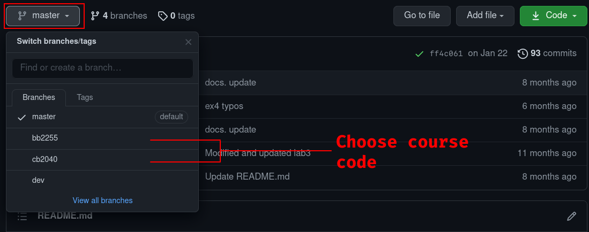
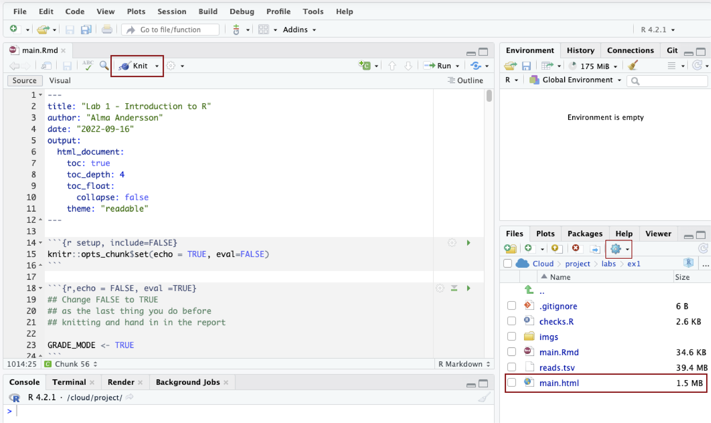

# Gene Technology Lab Course

Hello and welcome to the Gene Technology lab course landing page! This GitHub
repository contains all the instructions and material for the computer labs for
the two courses [CB2040](https://github.com/almaan/genetech/tree/cb2040) and 
[BB2255](https://github.com/almaan/genetech/tree/bb2255). Since the two 
aforementioned courses have a large overlap in content we store it at the same place.

For the computer labs, we'll be using the programming language R which is particularly 
useful for statistical computing and data visualization. R is together with Python one 
of the most popular languages for biological research and comes with a large ecosystem 
of open source packages to process and analyze biological data. 

As we (the TAs) are constantly trying to improve the course, we have decided to try 
something new for this year that we are hoping will make it easier for you to get started. 
Previous years, we have tried to provide instructions for how to set up a working R 
environment on the students own laptops, but we have realized that this is quite the 
challenge since students have access to different hardware and operating systems. We don't
want you to spend hours and hours stuck trying to intepret and solve error messages, so 
instead we are going to use a cloud based solution that only requires you to have a 
decent internet connection!

[RStudio cloud](https://rstudio.cloud/) is a cloud-based solution where everything
is preinstalled and ready to go. You will be provided with login details so that you 
can start coding directly from a web browser. 

For information about the computer exercises, you need to switch from the
_master branch_ of this repository to your course specific branch. To do this,
simply find the tab on this page that says "master", click it and select the
branch that corresponds to your course code (see image below):

**Note**: read through this page before switching to your course specific page.

## Getting started with RStudio cloud

Before you start working, you should have received an invite from the TAs. If
you click on the invite you will be redirected to this page where you can setup 
a new account:

When you have created an account and is logged in to RStudio cloud, you should 
see something like this:

If it's the first time you log in, you press the start button which will create 
a copy of the "genetech" project that will be your own. If you already have created a copy, 
you will see a continue button to access your project.

When you have opened the project, you should see the RStudio IDE (see image below).

1. __Text editor__ - This is where you will be able to modify files. We will be working with
the rmarkdown format where you can combine text and code.
2. __Console__ - Here you can run code outside of the rmarkdown file. All the code you run, either
in the rmarkdown file or in the console, share the same environment. This means that if you modify 
an object in the console, it might overwrite objects that you work on in the rmarkdown file and 
vice versa.
3. __Environment__ - Here you can see a list of all the variables created in your current environment. 
You can get infomation about properties of the variables and you can explore also expore their content.
4. __Files/Plots/Packages/Help/Viewer__ - Here you can access and interact with files stored locally 
and get documentation for certain R packages and functions. This is also where plots show up when 
executing code in the console. 

## Handing in reports

When you have written your answers in the rmarkdown document, you need to "knit" the document into an HTML 
file. First, you click on the Knit button and choose "Knit to HTML" which will trigger the knitting process. 
When the process has finished, you should see a file called "main.html" in the file explorer. To download 
this file, you can click on it and select "View in Web Browser" which will open up a new tab in your browser.
Then you right click on the page and save the webpage as a .html file on your own system. This is the file that
you will upload on Canvas! Just make sure that you can open the file and that you can see the content of it before 
uploading.

